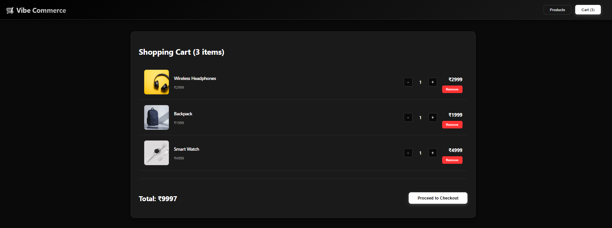
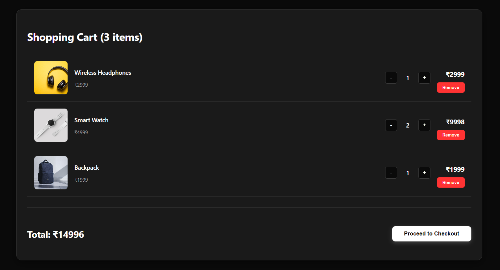
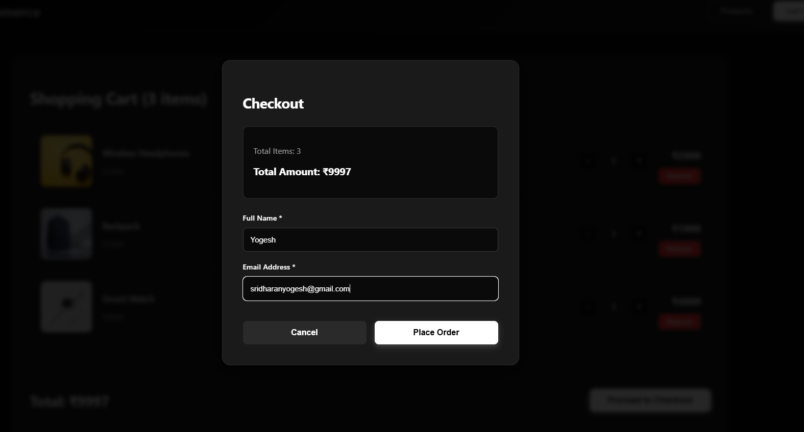
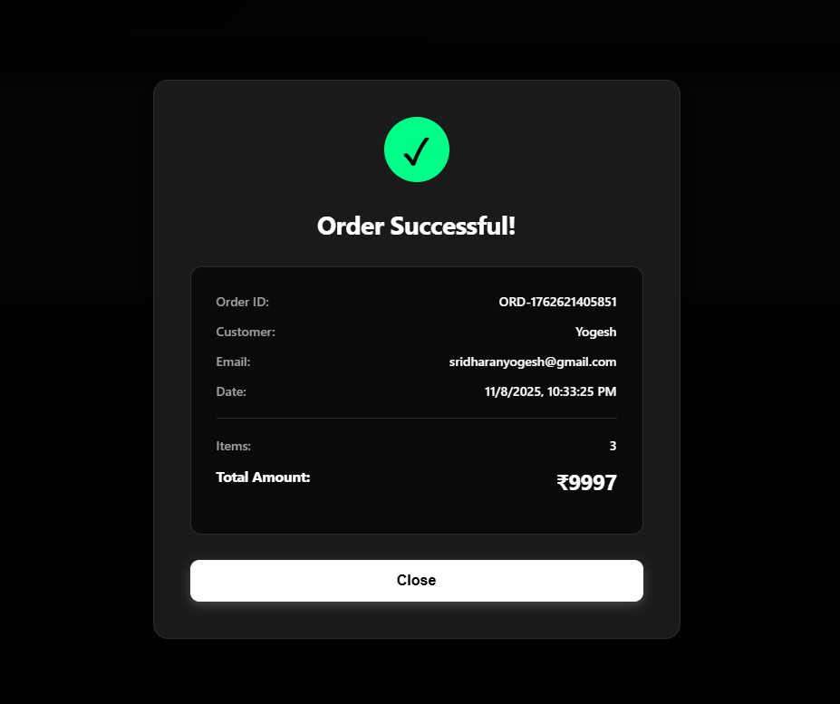

# Vibe Commerce - Full Stack Shopping Cart

A modern, full-stack e-commerce shopping cart built with the MERN stack (MongoDB, Express.js, React, Node.js) featuring a sleek dark UI and complete shopping functionality.

---

## 🎯 **Features**

### ✅ **All Requirements Met:**
- **Product Listing**: Browse 8 products with images, descriptions, prices
- **Shopping Cart**: Add, remove, and update item quantities
- **Cart Management**: Real-time cart total calculation
- **Checkout Flow**: Customer information form with validation
- **Order Receipt**: Mock checkout with order confirmation and receipt
- **Database Persistence**: MongoDB integration for cart and products
- **RESTful API**: Complete backend API with 5 endpoints
- **Modern UI**: Dark theme with professional typography and design

---

## 🛠️ **Tech Stack**

**Frontend:**
- React 18 with Vite
- Axios for API communication
- CSS-in-JS for styling
- Responsive design

**Backend:**
- Node.js & Express.js
- MongoDB with Mongoose ODM
- RESTful API architecture
- CORS enabled
- Environment variables with dotenv

**Database:**
- MongoDB Atlas (Cloud database)

---

## 📁 **Project Structure**

vibe-commerce-cart/
│
├── backend/
│ ├── models/
│ │ ├── Product.js # Product schema with Mongoose
│ │ └── Cart.js # Cart item schema
│ │
│ ├── routes/
│ │ ├── products.js # Product API endpoints
│ │ ├── cart.js # Cart management endpoints
│ │ └── checkout.js # Checkout and receipt endpoint
│ │
│ ├── .env # Environment variables (MongoDB URI, PORT)
│ ├── server.js # Express server setup and configuration
│ └── package.json # Backend dependencies
│
├── frontend/
│ ├── src/
│ │ ├── api/
│ │ │ └── api.js # API service layer for backend calls
│ │ │
│ │ ├── components/
│ │ │ ├── ProductCard.jsx # Individual product display component
│ │ │ ├── Cart.jsx # Shopping cart view component
│ │ │ ├── CheckoutModal.jsx # Checkout form modal
│ │ │ └── ReceiptModal.jsx # Order confirmation modal
│ │ │
│ │ ├── App.jsx # Main application component
│ │ └── main.jsx # React entry point
│ │
│ └── package.json # Frontend dependencies
│
├── screenshots/
│ ├── Products.png # Products page screenshot
│ ├── Cart.png # Shopping cart screenshot
│ ├── Cart2.png # Cart quantity controls screenshot
│ ├── Checkout.png # Checkout form screenshot
│ └── Receipt.png # Order receipt screenshot
│
├── .gitignore # Git ignore file
└── README.md # Project documentation

Setup Instructions
Prerequisites
Node.js v16 or higher

MongoDB Atlas account (free)

npm package manager

Backend Setup
Navigate to backend folder:

bash
cd backend
Install dependencies:

bash
npm install
Create .env file:

text
MONGODB_URI=your_mongodb_connection_string_here
PORT=5000
Start backend server:

bash
npm run dev
Seed database (one-time):
Open browser: http://localhost:5000/api/products/seed

Frontend Setup
Navigate to frontend folder:

bash
cd frontend
Install dependencies:

bash
npm install
Start frontend server:

bash
npm run dev
Open browser: http://localhost:5173

API Endpoints
Products
GET /api/products - Get all products

GET /api/products/seed - Seed 8 mock products

Cart
GET /api/cart - Get cart items with total

POST /api/cart - Add item to cart

PUT /api/cart/:id - Update item quantity

DELETE /api/cart/:id - Remove item from cart

Checkout
POST /api/checkout - Process checkout and generate receipt

How to Test
View 8 products on the home page

Click "Add to Cart" on any product

Navigate to Cart to see items

Use +/- buttons to adjust quantities

Click "Remove" to delete items

Click "Proceed to Checkout"

Fill in name and email

Submit to see order receipt with order ID and timestamp

Assignment Requirements Completed
✅ GET /api/products - 8 mock products
✅ POST /api/cart - Add items
✅ DELETE /api/cart/:id - Remove items
✅ GET /api/cart - Cart with total
✅ POST /api/checkout - Generate receipt
✅ React product grid with "Add to Cart"
✅ Cart view with quantities and totals
✅ Remove and update buttons
✅ Checkout form (name/email)
✅ Receipt modal
✅ Responsive design
✅ Database persistence
✅ Error handling

Technologies
Backend:

express: ^4.18.2

mongoose: ^7.0.3

cors: ^2.8.5

dotenv: ^16.0.3

nodemon: ^2.0.22

Frontend:

react: ^18.2.0

axios: ^1.4.0

vite: ^4.3.9

## Screenshots

### 1. Products Page

*Browse 8 products with modern dark theme, featuring images, prices, descriptions, and categories*

### 2. Shopping Cart

*View all items added to cart with individual prices and totals*

### 3. Cart Quantity Management

*Adjust item quantities using +/- buttons with real-time total updates*

### 4. Checkout Form

*Enter customer details (name and email) for order processing*

### 5. Order Success & Receipt

*Order confirmation with unique order ID, customer details, timestamp, and total amount*

Demo Video
https://www.loom.com/share/c420b15be8044366b7c4920479718d49?t=52

Developer
Assignment: Vibe Commerce Full Stack Developer Internship
Submission Date: November 8, 2025

